<a name="Title" />
# Data Visualization with Processing and Twitter API #

---
<a name="Overview" />
## Overview ##

The Internet is home to an almost insurmountable amount of raw data. While humans are great at a lot of things like [riding bikes] (http://damien.pobel.fr/images/backflip-qui-part-mal-en-bmx-street.jpg) and [depleting Earth's natural resources] (http://upload.wikimedia.org/wikipedia/commons/0/05/Coal_mine_Wyoming.jpg), we aren't so great at parsing a lot of data. Luckily, computers are really good at parsing and sorting lots of data. We can even ask computers to process that data and output a result that is significant to us. 

We'll use [Twitter](http://twitter.com) as our source of data, since Twitter's always happening and it has a pretty intuitive API. For the uninitiated, Twitter is a social networking service that allows users to post short messages for the world to see. We can grab the public tweets from all of Twitter's users, sort and filter the tweets, and get the information we desire. This information could be useful for any sort of study that requires a lot of subjects, but on top of that, it's usually pretty interesting just to look at. Considering that there's somewhere between 5,000 and 10,000 tweets sent every second, it's easy to see that we have plenty to work with. 

We'll also use [Processing](https://processing.org/), an open-source development environment that makes it easy to produce visuals. It defaults to Java, but there are other modes that can be downloaded for other applications. Because most intro Computer Science classes use Java, we'll stick to that for now. 

For other examples of data visualizations, I suggest you check out the [DataIsBeautiful Subreddit](http://www.reddit.com/r/dataisbeautiful). It's a great community and can spark inspiration for projects. Do something awesome.

---

<a name="Tasks">
## What You're Getting Yourself Into ##

In this walkthrough, we will cover:

1. [Getting Started with Processing] (#Processing Intro)

2. [Getting Started with the Twitter API] (#Twitter Intro)

3. [Importing the Twitter4J library] (#Import Library)

4. [Getting Data from Twitter to Processing] (#Getting Data)

5. [Setting Up a Data Visualization] (#Setting Up)

6. [Drawing the Data Visualization] (#Drawing)

7. [Wrapping Up] (#Wrapup)

Get excited.

---

---

<a name="Tasks">
## What You're Getting Yourself Into ##

In this walkthrough, we will cover:
1. Getting Started with Processing (#Processing Intro)
1. Getting Started with the Twitter API (#Twitter Intro)
1. Importing the Twitter4J library (#Import Library)
1. Getting Data from Twitter to Processing (#Getting Data)
1. Setting Up a Data Visualization (#Setting Up)
1. Drawing the Data Visualization (#Drawing)
1. Wrapping Up (#Wrapup)

Get excited.
---

<a name="Processing Intro">
## Getting Started with Processing ##

We have some work to do before we can begin the fun. You have to eat your vegetables before dessert. Let's set up Processing. 

1. Go to the Processing website, https://processing.org/ 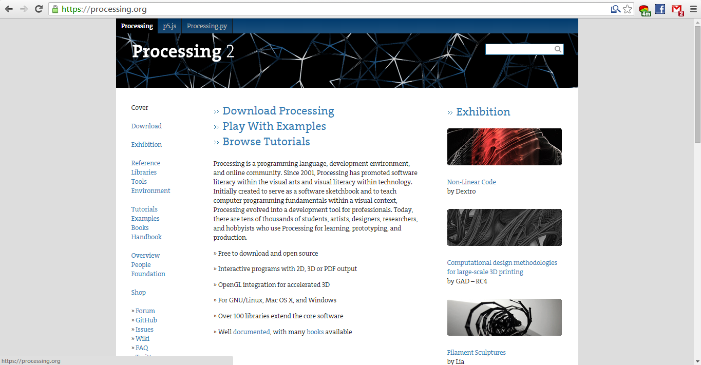

2. Click "Download Processing". You don't have to donate, but you can if you want. 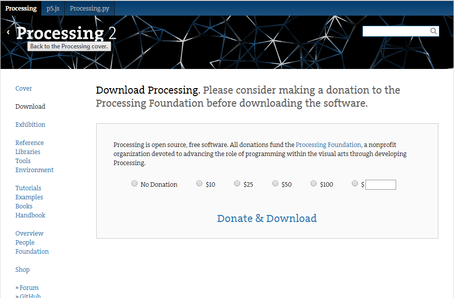

3. Unzip and extract Processing to a convenient location. There is no installation required. 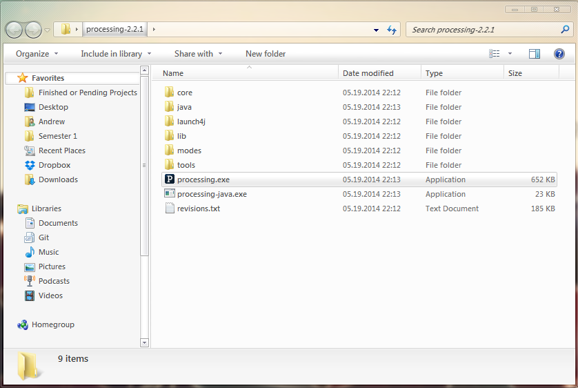

4. Run processing.exe. After a splash screen, you should see the sketch window.  

Let's get acquainted with some of Processing's features. You'll notice in the top right there's a little box specifying that the current language is Java. Under the file menu, there's a toolbar with buttons to run, stop, create a new file, open, save, and export the application. You write your code in the text editor, and there's a console at the bottom. 

Processing comes built in with a plethora of sweet examples that can be accessed by going to File > Examples... Feel free to peruse these and see some of the things you can easily do with the software. 

As far as coding goes, Processing has two extra-important functions, setup(), and draw(). Since Processing is focused on creating visuals, both of these functions should be present in every application. If they aren't, Processing will do its best, but things might get sticky. 

So without further ado, let's write our first application, the classic Hello World. 

>void setup()

>{

>print("Hello World");

>}

>void draw()

>{

>}

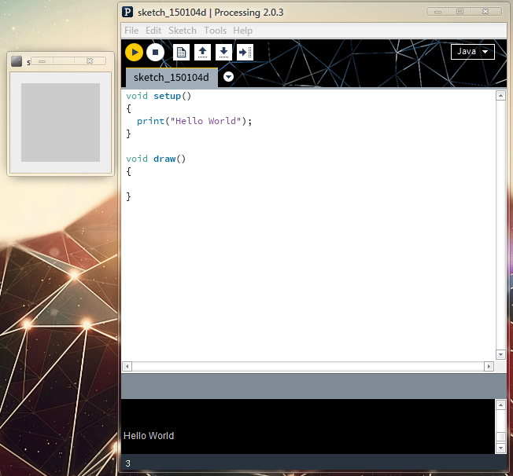

Neat! You'll notice that a cute little gray box appeared next to the development pane. **This is the window in which things will be drawn!** Right now, we're just printing things to the console so nothing is there, but we'll learn some tools to make the magic happen. 

---

<a name="Twitter Intro">
## Getting Started with the Twitter API ##

Now that you know the basics of Processing, let's connect it to Twitter! There's a little bit of setup for this too, so hold tight. Make sure you have a Twitter account, because you need one to access the dev tools. 

1. Go to https://apps.twitter.com/ and log in. 
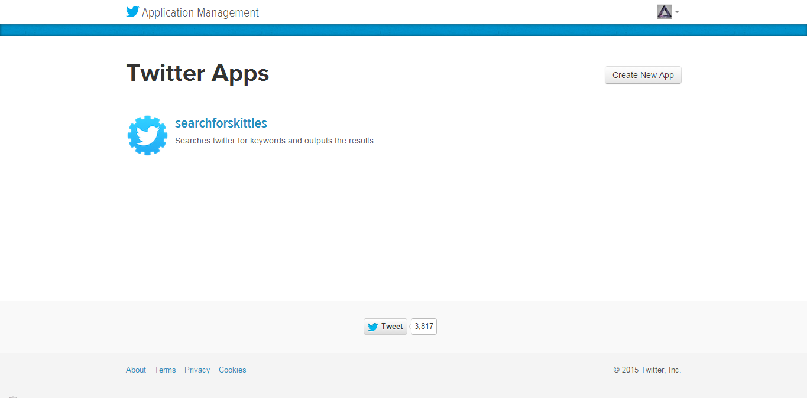
2. Create a new app using the "Create New App" button. 
3. Fill out the fields however you like, it's not super important. We're after some authorization credentials that Twitter assigns to each app, but it doesn't matter what you write in the fields. 
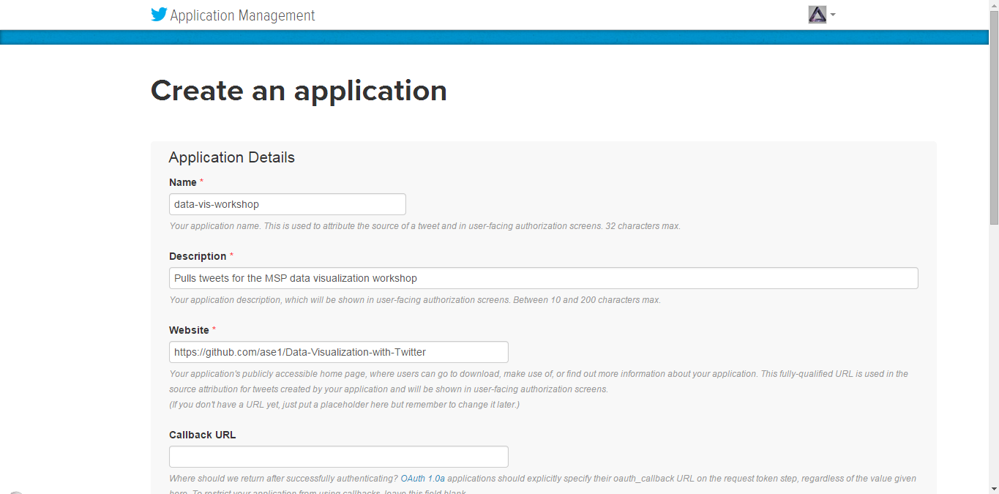
4. Once you agree to the terms and create the app, navigate to "Keys and Access Tokens". We need four strings from this page to gain access to all of Twitter. I Captcha-d my credentials so you guys don't tweet dirty things on my behalf. 
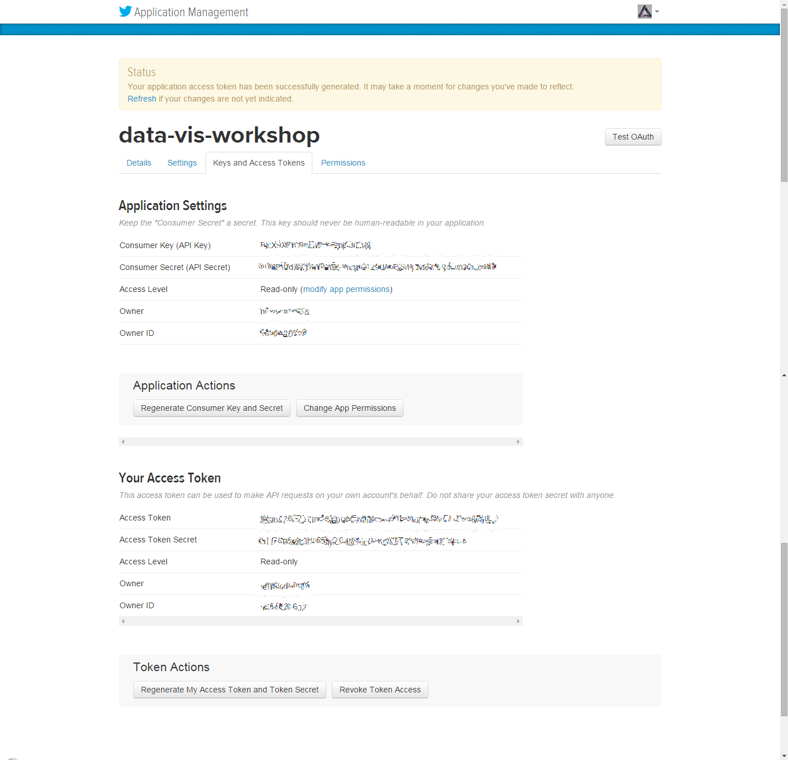
5. Click the "Create my Access Token" button. Proceed. 

6. Click "Test OAuth" at the top, and hold on to those four strings. They're important. 
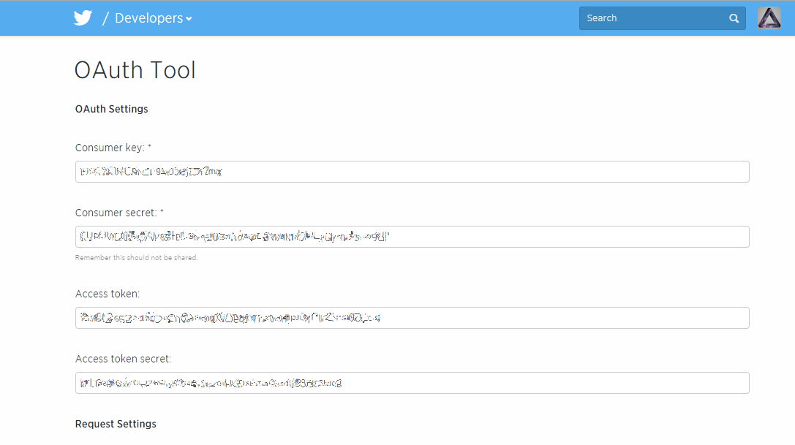
7. Twitter is all set up! We're ready to make our app. 

<a name="Import Library">
## Importing the Twitter4J Library ##
We now need a library to help Java interact with Twitter. There's a very handy *unofficial* Java library called [Twitter4J](http://twitter4j.org/en/index.html). 
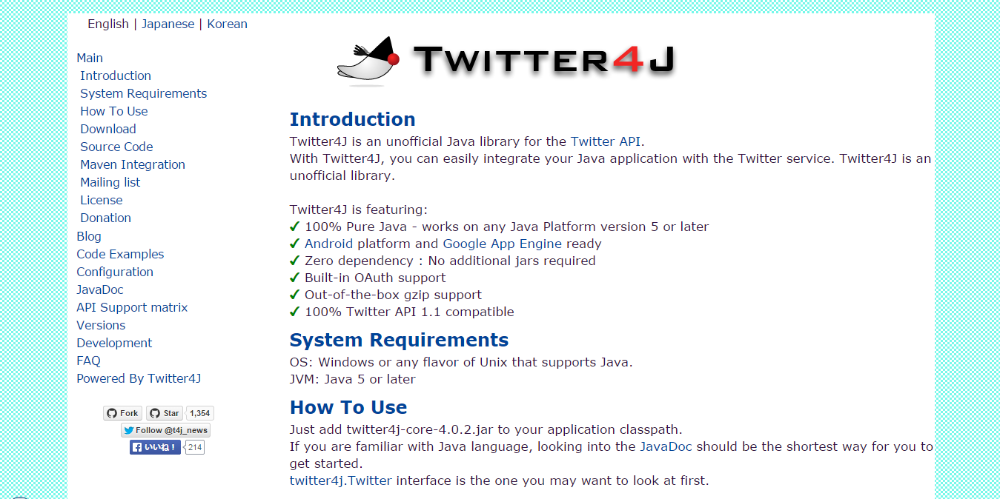

Go to the Twitter4J website, download the latest stable version, and unzip to a folder. 
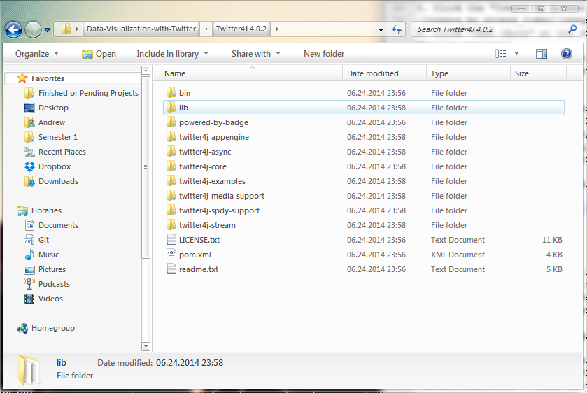

In the "lib" subfolder, you'll see a couple *.jar* files. We need these so keep them handy. 

---

<a name="Getting Data">
## Getting Data From Twitter ##

So now that the easy stuff is done, we have to think of something to try to visualize. Twitter's often used for sports updates, because it's lightning-quick and people have nothing better to talk about. **Let's see if we can visualize the popularity of two different sports teams in real time!** 

First things first, we need to import the Twitter4J library into Processing. This is super easy, just drag those *twitter4j-XXXX-4.0.2.jar* files into the Processing Window. The message pane in Processing will tell you that five files were added to the sketch. 

Now, let's get Twitter's resources into Processing. We need four static Strings: *OAuthConsumerKey*, *OAuthConsumerSecret*, *AccessToken*, and *AccessTokenSecret*. These do not have to be defined within any function. 
In addition to the strings, we need a TwitterStream object to receive tweets. This also goes with the config variables. 

>static String OAuthConsumerKey = "[YOUR_CREDENTIALS_HERE]";

>static String OAuthConsumerSecret = "[YOUR_CREDENTIALS_HERE]";

>static String AccessToken = "[YOUR_CREDENTIALS_HERE]";

>static String AccessTokenSecret = "[YOUR_CREDENTIALS_HERE]";

>TwitterStream twitter = new TwitterStreamFactory().getInstance();

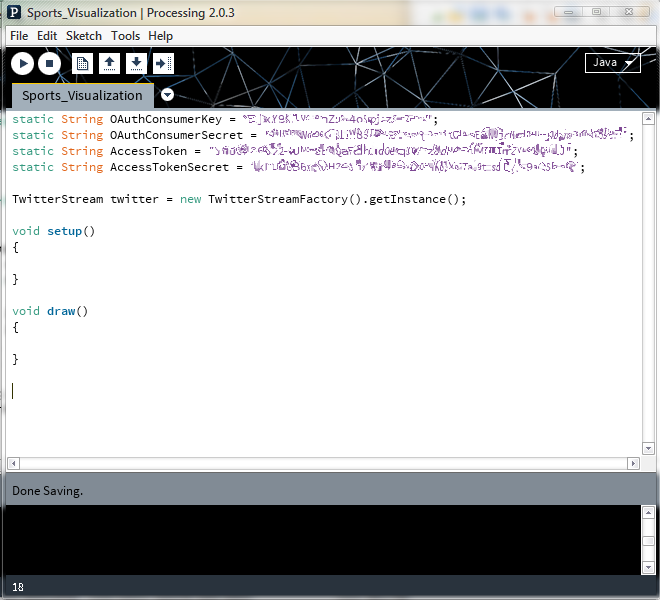

Also, before we get ahead of ourselves, let's save our work. 

Now, in the setup() function, we need to tell our application to connect to Twitter and to receive data. We do this using a *listener*. 
>void setup()

>connectTwitter();

>twitter.addListener(listener);

We also need a couple lines of code at the bottom to define these functions and use the credentials. It's easiest to just copy and paste these. 

>// Initial connection

>void connectTwitter() {

>  twitter.setOAuthConsumer(OAuthConsumerKey, OAuthConsumerSecret);

>  AccessToken accessToken = loadAccessToken();

>  twitter.setOAuthAccessToken(accessToken);

>}

>// Loading up the access token

>private static AccessToken loadAccessToken() {

>  return new AccessToken(AccessToken, AccessTokenSecret);

>}

>// This listens for new tweet

>StatusListener listener = new StatusListener() {

>  public void onStatus(Status status) {}

>  public void onStallWarning(StallWarning stallwarning){}

>  public void onDeletionNotice(StatusDeletionNotice statusDeletionNotice) {}

>  public void onTrackLimitationNotice(int numberOfLimitedStatuses) {}

>  public void onScrubGeo(long userId, long upToStatusId) {

>    System.out.println("Got scrub_geo event userId:" + userId + " upToStatusId:" + upToStatusId);

>  }

>  public void onException(Exception ex) {

>    ex.printStackTrace();

>  }

>};

Let's grab a random tweet and print it to the console to make sure everything's working. 

In the setup() function, we tell the app to search a random sampling of Twitter. Add: 
>twitter.sample();

Then, we have to print that to the console. We create a boolean *bool*, set to **true**. Then, in the StatusListener initialization (under the function onStatus), we use the following code snippet: 

>while(bool)

>{

>  println("@" + status.getUser().getScreenName() + " - " + status.getText());

>  bool = false;

>}

This snippet prints a random tweeter and their tweet. Because the listener is *listening* constantly, we need to escape (otherwise, the console will freak out, showing all of the tweets from twitter in a brilliant spasm of text). Thus, we use *bool* coupled with a while() statement to escape. 

If the description above is confusing, here's a nice little screenshot. 

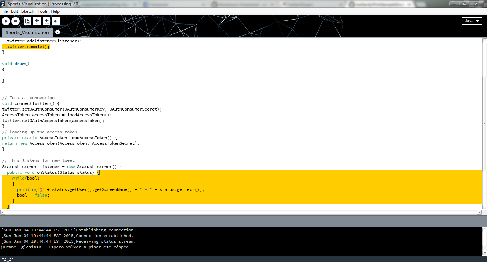

*Big congrats to @Franc_IglesiasB for the winning tweet.*
<<<<<<< HEAD

---

=======

---

>>>>>>> e6007c0f383d8ab8b64ff17e4cf88bbab35e19e5
<a name="Setting Up">
## Setting Up a Data Visualization ##

Let's get started with the real data now! For this visualization, the user inputs two sports teams that are playing. We then visualize a sort of popularity tug-of-war; whoever gets tweeted more gets a bigger piece of the digital pie. We need a place to enter the two teams, so we make a couple Strings and associated counters to count the number of tweets. I chose the Lions and the Cowboys because the two teams had recently played and I'm sure the Twitterverse is hot and bothered about it. 

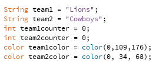

Again, we need to define which part of Twitter should be searched in setup(). Since we're only looking for two keywords, "Lions" and "Cowboys", we can filter out everything else. To do this, we create an array for the keywords, and then use Twitter4J's *filter()* function. 

>String keywords[] = {team1, team2};

>twitter.filter(new FilterQuery().track(keywords));

Then, we need to count the number of tweets each team gets. We go back into our listener, and create a couple if statements that will add to the counters if we get a hit. To search each tweet, we use:

>status.getText().indexOf(*string*)

This outputs the index of the mention of the team. However, if the team wasn't mentioned in the tweet, then the index is -1. Therefore, we know we have a match whenever the index is *not -1*. Pretty neat, huh?

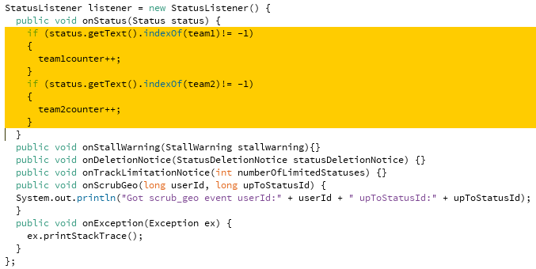

So now we have our data. Let's make a nice visual. FYI: The program can be run in full screen using Ctrl+Shift+R. 

Let's make a scoreboard first. In setup(), we set the size of the window to your display resolution (mine is 1366p x 768p), the font type, and the background color. We use variables *width* and *height* because we may need to reference these again. 

>  size(width, height);

>  f = createFont("Segoe UI", 48);

>  textFont(f);

>  background(color(0,0,0));

We also need to initialize PFont and PImage objects as config variables. 

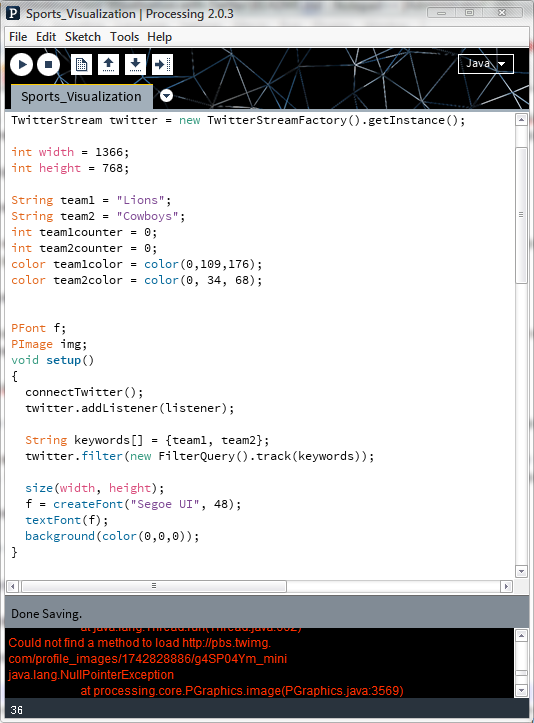

We're officially finished with setup! Let's get to drawing. 

---

<a name="Drawing">
## Creating a Data Visualization ##

For the scoreboard, we make two jumbotrons with the team names, and bars showing the percentage of total tweets each team received. First, we set the color of the jumbotrons, then we assign each a size. 

>  fill(color(40,40,40)); *//fill with gray*

>  rect(width*0, height*.05, width*.4, height*.1); *//draws a rectangle, using coords (x1,y1,x2,y2)*

>  rect(width*.6, height*.05, width*1, height*.1); 

Then, let's label each team. 

>  fill(color(255,255,255));

>  text(team1, width*.15, height*.125);

>  text(team2, width*.75, height*.125);

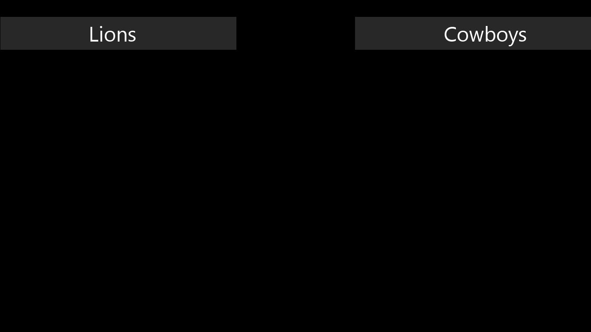

Now let's calculate the percentage of tweets that the Lions receive, out of the total. 

>double percent = (double)team1counter / (team1counter+team2counter+1);  *//+1 to avoid div by zero*

We create two more rectangles, using this percentage value. This will make a colored bar in the middle that shows the percentage of tweets for each team. 

>fill(team1color);

>rect(width*0, height*.25, (int)(width*percent), height*.4);

>fill(team2color);

>rect((int)(width*percent), height*.25, width*1, height*.4);

Lastly, let's show the numerical percentage in the middle of the bar. It's a total mess of casting, but you get the idea. The numbers are fudged, I chose what looked best to me, though you're entirely welcome to try to calculate the perfect center for each value. 

>fill(team2color);

>text(Double.toString(round((float)percent*1000)/(double)10)+"%", (int)(percent*width/2.5), (int)height*.47);

>fill(team1color);

>text(Double.toString(100-round((float)percent*1000)/(double)10)+"%", width-(int)((1-percent)*width/1.9), (int)height*.47);*/

Here's the finished draw() function! Output follows. 

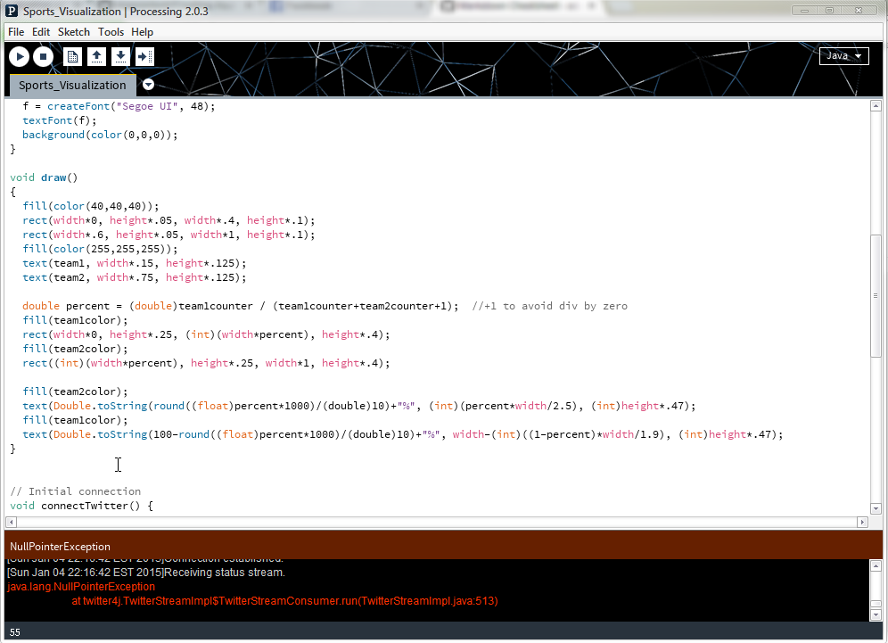

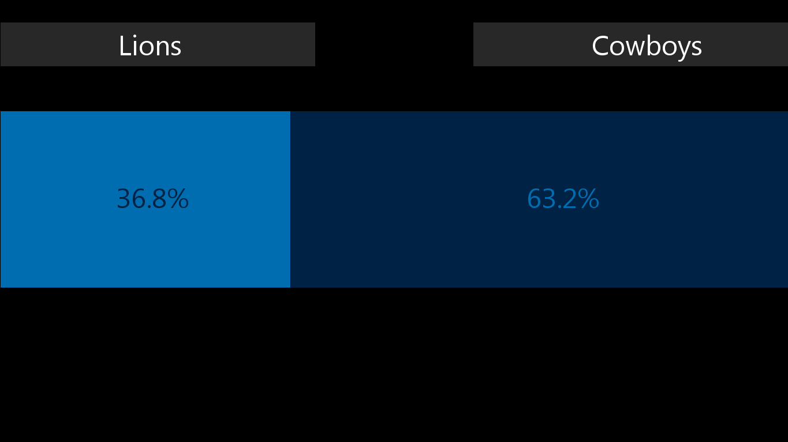

Lastly, let's try to fill in some of that empty space at the bottom. We have access to a lot of information about each tweet, we just need to figure out how to coax it out of Twitter. It'd be really neat if that, for each tweet, the user's picture was displayed below the team to form a sort of army of sports fans. We can actually do this with only two more lines of code! This is why we initialized the PImage object earlier. 

To accomplish this, we'll use the mini profile image of each user. We can get the URL of this picture from the status with 

>status.getUser().getMiniProfileImageURL()

Then, we load this image from the Internet. 

>loadImage((status.getUser().getMiniProfileImageURL()))

Lastly, we need to draw that image. We add image() around the loaded image and specify where to place it. Maybe we'll scatter them randomly under the team name. 

>image(loadImage((status.getUser().getMiniProfileImageURL())), (int)random(width*.45), height-(int)random(height*.4));

But we only do this once we find the right tweet. Therefore, it belongs under the if statement determining if the tweet contains the team name. 

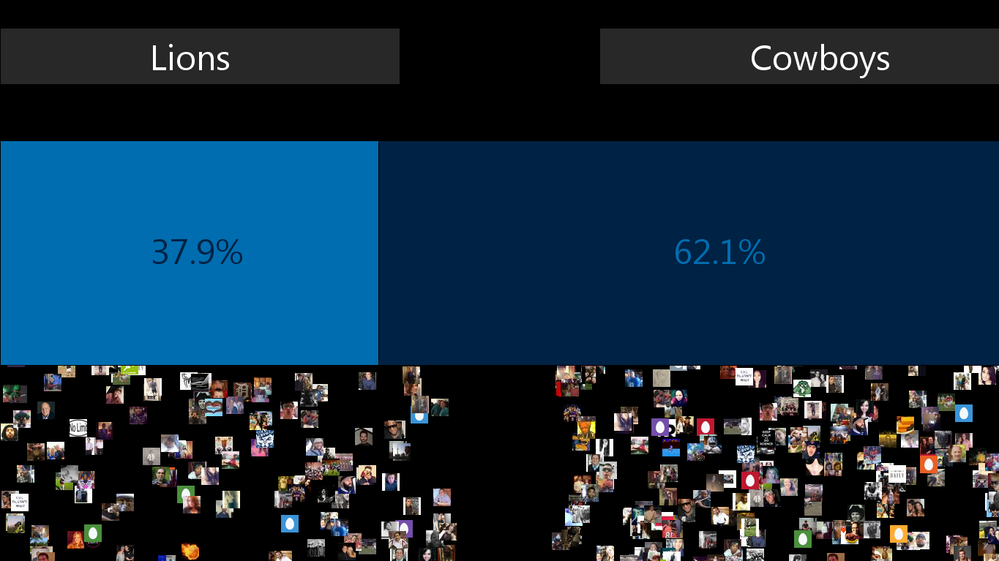

---
<a name="Wrapup">
## Wrapping Up ##

Awesome! We now have a pretty interesting and dynamic data visualization of a current event (football game). Of course, the two team names can be swapped for any two keywords, which surely could show interesting relationships between other things. 

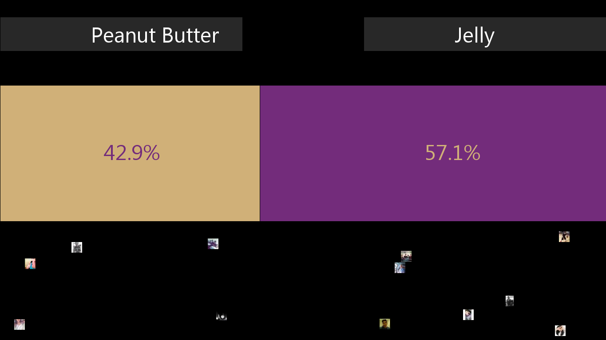

Processing is a tremendously powerful tool for data visualization, but this workshop was kept pretty simple to stay time-friendly. Go out, and make amazing things. 
---